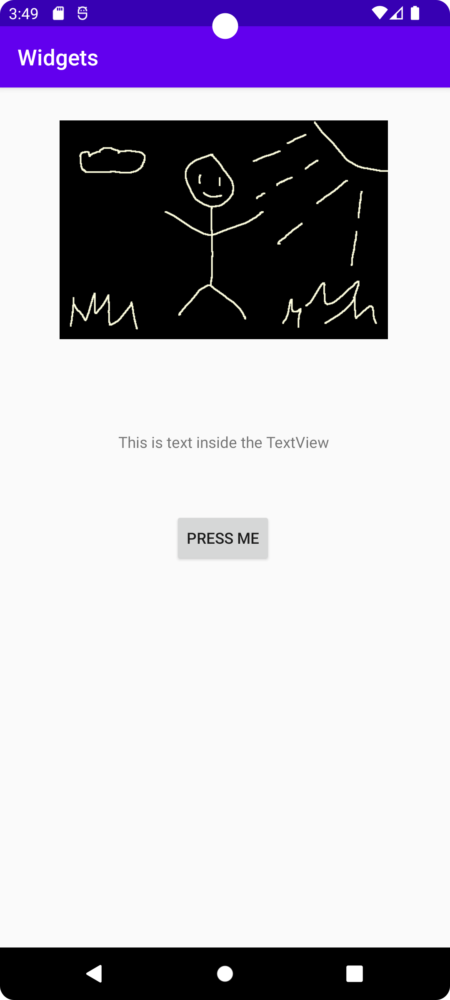
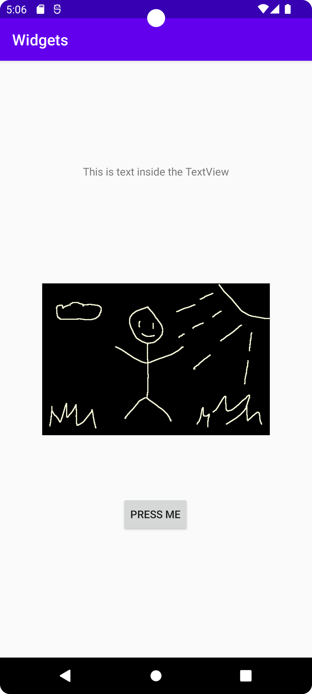

# Report

Removed the existing textview element and created a constraint layout.
Added an image to res/drawables and created an imageview and loaded the 
image into it

These changes were pushed to the Github repository.

Set the constraints for the image and set width of image to 300dp and 
height to 260dp. Added a content description to the image.
Proceeded with adding a textview and a button. Set the constraints and 
margins for the textview and button to adjust their positions.

These changes were pushed to the Github repository.

Set constraints for the constraint layout and proceeded to test the app
in the emulator (Pixel 6 with version 31). The result can be seen in 
Image 1.

**Image 1 **  <br/><br/>


Repositioned the image to middle of screen by changing the vertical
constraints. Moved the textview above the image and changed its 
constraints. Set a top margin on button to get som space between it
and the image.

These changes were pushed to the Github repository.

Moved some hardcoded strings for the elements into strings.xml and replaced
them with references in the code, which can be seen in these code snippets:

```
android:contentDescription="@string/image_description"
```
```
android:text="@string/button_text"
```
```
android:text="@string/text_content"
```

This change was pushed to the Github repository.

Tested the app again in the emulator to see that all was showing correctly.
The result can be seen in Image 2.

**Image 1 **  <br/><br/>

